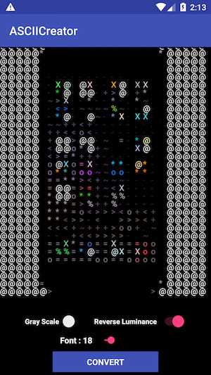
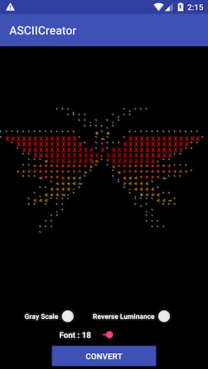

# ASCII-Art-Generator

[](https://github.com/zelin/ASCII-Art-Generator)
[](https://github.com/zelin/ASCII-Art-Generator)
[](https://github.com/zelin/ASCII-Art-Generator)
[](http://neberox.tk/donate/?amount=2&currency=USD)




## Installation

The easiest way to add the library to your project is by adding it as a dependency to your build.gradle

```ruby
dependencies {
   implementation 'com.neberox.library:asciicreator:0.0.1'
}
```

## Usage

### Using ASCIIConverter class

Create a ASCIIConverter object

```java
ASCIIConverter converter = new ASCIIConverter();
```

Create ASCII from bitmap

```java
Bitmap bitmap = BitmapFactory.decodeResource(getResources(), R.drawable.test_image);
imgView.setImageBitmap(converter.createASCIIImage(bitmap));
```

Convert in the background async task providing a completion block. 
Completion block will be called on the main thread.

```java
converter.createASCIIImage(bitmap, new OnBitmapTaskListener()
{
    @Override
    public void onTaskCompleted(Bitmap data)
    {
        imgView.setImageBitmap(data);
    }
});
```

Convert to String
```java
Log.d("ASCII-GENERATOR", converter.createASCIIString(bitmap));
```

Convert in the background async task providing a completion block. 
Completion block will be called on the main thread.

```java
converter.createASCIIString(bitmap, new OnStringTaskListener()
{
    @Override
    public void onTaskCompleted(String data)
    {
        Log.d("ASCII-GENERATOR", data);
    }
});
```

#### Options available

```java
converter.setFontSize(18);
converter.setReversedLuminance(false);
converter.setGrayScale(false);
converter.setBackgroundColor(Color.RED);
```

## More Options

By default luminance values are mapped to strings using 

```java
Map<String, Float> map = new HashMap<String, Float>();
map.put(" ", 1.0f);
map.put("`", 0.95f);
map.put(".", 0.92f);
map.put(",", 0.9f);
map.put("-", 0.8f);
map.put("~", 0.75f);
map.put("+", 0.7f);
map.put("<", 0.65f);
map.put(">", 0.6f);
map.put("o", 0.55f);
map.put("=", 0.5f);
map.put("*", 0.35f);
map.put("%", 0.3f);
map.put("X", 0.1f);
map.put("@", 0.0f);
```

You can instantiate a converter with your own map

```java
Map<String, Float> map = new HashMap<String, Float>();
map.put(" ", 1.0f);
map.put("`", 0.95f);
map.put(",", 0.9f);
map.put("-", 0.8f);
map.put("+", 0.7f);
map.put("<", 0.65f);
map.put("o", 0.55f);
map.put("=", 0.5f);
map.put("%", 0.3f);
map.put("@", 0.0f);

converter = new ASCIIConverter(Activity.this, map)
```

## Potential Improvements
* Creating an ASCIIImageView to automatically generate ASCII from bitmap
* Implementing more options for creating ASCII

## Author

Muhammad Umar, https://github.com/zelin

## License

ASCII-Art-Generator is available under the MIT license. See the LICENSE file for more info.
